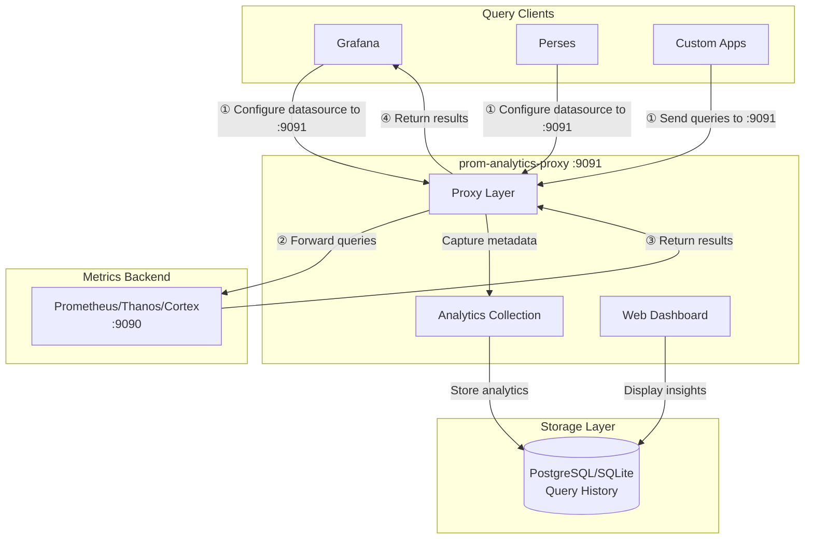

# prom-analytics-proxy

[](https://github.com/nicolastakashi/prom-analytics-proxy/actions/workflows/container-image.yaml)
[](LICENSE)
[](https://goreportcard.com/report/github.com/nicolastakashi/prom-analytics-proxy)

> **⚠️ IMPORTANT: Configuration Required**
>
> `prom-analytics-proxy` is a **man-in-the-middle proxy** that sits between your query clients (Grafana, Perses, etc.) and your metrics backend (Prometheus, Thanos, Cortex).
>
> **You MUST reconfigure your query clients to point at the proxy** (default port `:9091`) instead of directly to your metrics backend. Without this reconfiguration, the proxy will not capture any query traffic and you will see no analytics data.

## Table of Contents

- [Overview](#overview)
- [Architecture](#architecture)
- [Quick Start](#quick-start)
- [Features](#features)
- [Project Structure](#project-structure)
- [Configuration](#configuration)
- [Troubleshooting](#troubleshooting)
- [API Reference](#api-reference)

## Overview

`prom-analytics-proxy` is a powerful observability tool that acts as a transparent proxy between your Prometheus server and its clients. It provides deep insights into your PromQL query patterns, helping you optimize performance and resource usage while maintaining complete visibility into your monitoring stack.

### Watch the Introduction Video

[](https://www.youtube.com/watch?v=8PX4FwgxUd8)

*Learn how prom-analytics-proxy can help you gain insights into your Prometheus queries and optimize your monitoring setup.*

## Architecture

`prom-analytics-proxy` works as an intercepting proxy that must be placed between your query clients and your metrics backend. Understanding this architecture is crucial for successful deployment.



### How It Works

1. **Query Interception**: Your query clients (Grafana, Perses, etc.) send PromQL queries to the proxy instead of directly to your metrics backend
2. **Query Forwarding**: The proxy forwards these queries to your actual Prometheus/Thanos/Cortex instance
3. **Analytics Capture**: While proxying, it captures query patterns, execution times, series counts, and other metadata
4. **Result Passthrough**: Query results are returned to the client transparently, maintaining full compatibility
5. **Data Storage**: Analytics data is stored in PostgreSQL or SQLite for analysis
6. **Visualization**: The built-in web UI provides insights into your query patterns and performance

### Key Points

- The proxy adds minimal latency to queries (typically <10ms)
- It's completely transparent to query clients - they see the same API as Prometheus
- No changes are required to your metrics backend
- The proxy supports all PromQL query types (instant, range, series, labels, etc.)
- Works with Prometheus, Thanos, Cortex, and any Prometheus-compatible backend

## Quick Start

Get up and running in 3 simple steps:

### 1. Start the Proxy

```bash
git clone https://github.com/nicolastakashi/prom-analytics-proxy.git
cd prom-analytics-proxy
make build
./prom-analytics-proxy -upstream http://your-prometheus-server:9090
```

The proxy listens on port `:9091` by default.

### 2. Reconfigure Your Query Clients

**Critical:** Update your query clients (Grafana, Perses, etc.) to send queries to the proxy at port `:9091` instead of directly to your metrics backend.

Example for Grafana: Change your Prometheus datasource URL from `http://prometheus:9090` to `http://prom-analytics-proxy:9091`.

### 3. Verify Data Collection

Open `http://localhost:9091` and execute some queries through your clients. You should see analytics data appear in the UI.

**📖 See the complete [Quick Start Guide](docs/quick-start.md) for detailed setup instructions, configuration examples, and deployment patterns.**

### Try It Out with Docker Compose

Want to see it in action? Use our ready-to-run example:

```bash
cd examples
docker compose up -d
```

This starts a complete stack with Prometheus, the proxy, PostgreSQL, Perses dashboards, and Metrics Usage tracking. Access the proxy UI at `http://localhost:9091`.

See the [examples/](examples/) directory for configuration templates and integration examples.

## Features

### Query Analytics

- Detailed statistics on PromQL queries
- Execution time tracking
- Resource consumption metrics
- Series count analysis

### Metrics Usage

- Integration with Perses Metrics Usage
- Multi-source data correlation
- Comprehensive metrics tracking
- [Learn more about Metrics Usage Integration](#metrics-usage-integration)

### Data Storage

- PostgreSQL support
- SQLite support
- Flexible storage options
- Efficient data management

### Database migrations

- Uses Goose with embedded SQL migrations per dialect (PostgreSQL and SQLite)
- Migrations run automatically at startup; prefer a single init step in production

### User Interface

- Intuitive web-based dashboard
- Query performance visualization
- Query Shortcuts for common patterns
- Real-time analytics

## Project Structure

The project is organized into two main components:

### Backend (`prom-analytics-proxy`)

- Go-based proxy application
- Query analytics collection
- Performance metrics processing
- Data storage management

### Frontend (`prom-analytics-proxy-ui`)

- React-based user interface
- Data visualization
- Query analysis tools
- Interactive dashboards

## Configuration

The application can be configured through command-line flags or a configuration file. Here are the key configuration options:

### Basic Configuration

```yaml
# Example configuration
upstream: "http://prometheus:9090"
insecure-listen-address: ":9091"
database-provider: "postgresql" # or "sqlite"
```

### Database Configuration

```yaml
# PostgreSQL
postgresql-addr: "localhost"
postgresql-port: 5432
postgresql-database: "prom_analytics"
postgresql-user: "user"
postgresql-password: "password"

# SQLite
sqlite-database-path: "prom-analytics-proxy.db"
```

### Performance Tuning

```yaml
insert-batch-size: 10
insert-buffer-size: 100
insert-flush-interval: "5s"
insert-grace-period: "5s"
insert-timeout: "1s"
```

```bash mdox-exec="go run main.go --help" mdox-expect-exit-code=0
  -config-file string
    	Path to the configuration file, it takes precedence over the command line flags.
  -database-provider string
    	The provider of database to use for storing query data. Supported values: postgresql, sqlite.
  -include-query-stats
    	Request query stats from the upstream prometheus API. (default true)
  -insecure-listen-address string
    	The address the prom-analytics-proxy proxy HTTP server should listen on. (default ":9091")
  -insert-batch-size int
    	Batch size for inserting queries into the database. (default 10)
  -insert-buffer-size int
    	Buffer size for the insert channel. (default 100)
  -insert-flush-interval duration
    	Flush interval for inserting queries into the database. (default 5s)
  -insert-grace-period duration
    	Grace period to insert pending queries after program shutdown. (default 5s)
  -insert-timeout duration
    	Timeout to insert a query into the database. (default 1s)
  -inventory-enabled
    	Enable the metrics inventory syncer (default true)
  -inventory-job-index-label-timeout duration
    	Timeout for job label values collection (default 30s)
  -inventory-job-index-per-job-timeout duration
    	Timeout for processing each individual job (default 30s)
  -inventory-job-index-workers int
    	Number of worker goroutines for job index processing (default 10)
  -inventory-metadata-timeout duration
    	Timeout for metadata collection step (default 30s)
  -inventory-run-timeout duration
    	Timeout for the entire inventory sync run (default 5m0s)
  -inventory-summary-timeout duration
    	Timeout for summary refresh step (default 30s)
  -inventory-sync-interval duration
    	Interval between inventory sync runs (default 10m0s)
  -inventory-time-window duration
    	Time window for inventory data collection (default 720h0m0s)
  -log-format string
    	Log format (text, json) (default "text")
  -log-level string
    	Log level (default "INFO")
  -metadata-limit uint
    	The maximum number of metric metadata entries to retrieve from the upstream prometheus API. (default 0 which means no limit)
  -postgresql-addr string
    	Address of the postgresql server. (default "localhost")
  -postgresql-database string
    	Database for the postgresql server, can also be set via POSTGRESQL_DATABASE env var.
  -postgresql-dial-timeout duration
    	Timeout to dial postgresql. (default 5s)
  -postgresql-password string
    	Password for the postgresql server, can also be set via POSTGRESQL_PASSWORD env var.
  -postgresql-port int
    	Port of the postgresql server. (default 5432)
  -postgresql-sslmode string
    	SSL mode for the postgresql server. (default "disable")
  -postgresql-user string
    	Username for the postgresql server, can also be set via POSTGRESQL_USER env var.
  -series-limit uint
    	The maximum number of series to retrieve from the upstream prometheus API. (default 0 which means no limit)
  -sqlite-database-path string
    	Path to the sqlite database. (default "prom-analytics-proxy.db")
  -upstream string
    	The URL of the upstream prometheus API.
```

### Tracing Support

The prom-analytics-proxy application includes built-in support for distributed tracing using OpenTelemetry. To enable tracing, you must provide a configuration file specifying the tracing settings. Below is an example configuration and details for each option:

```yaml
tracing:
  client_type: ""
  service_name: ""
  resource_attributes: {}
  reconnection_period: 0s
  compression: ""
  insecure: false
  endpoint: ""
  url_path: ""
  timeout: 0s
  retry_config:
    retry_enabled: false
    retry_initial_interval: 0s
    retry_max_interval: 0s
    retry_max_elapsed_time: 0s
  headers: {}
  tls_config:
    ca_file: ""
    cert_file: ""
    key_file: ""
    server_name: ""
    insecure_skip_verify: false
  sampler_type: ""
  sampler_param: ""
```

### Metrics Usage Integration

The `prom-analytics-proxy` application integrates with Perses Metrics Usage to gather and correlate metrics usage data from multiple sources. Essentially, `prom-analytics-proxy` acts as a backend for the Metrics Usage frontend, providing the data needed to populate the UI.

Because Metrics Usage is a separate project, you must deploy it alongside `prom-analytics-proxy` to enable this feature. Once configured, `prom-analytics-proxy` sends the collected data to the Metrics Usage backend, which is then displayed in the Metrics Usage UI. For more information, see the [Metrics Usage repository](https://github.com/perses/metrics-usage).

**Try it out:** The [examples/docker-compose.yaml](examples/docker-compose.yaml) includes a complete setup with Metrics Usage integration. Configuration files are available in [examples/config/metrics-usage/](examples/config/metrics-usage/).

### Inventory Configuration

The inventory syncer maintains a catalog of metrics and their usage patterns. It uses concurrent processing to handle large numbers of jobs efficiently. It can be configured with the following options:

```yaml
inventory:
  enabled: true # Enable inventory syncing (default: true)
  sync_interval: 10m # How often to sync inventory (default: 10m)
  time_window: 720h # Time window for usage analysis (default: 30 days)
  run_timeout: 30s # Timeout for entire sync run (default: 30s)
  metadata_step_timeout: 15s # Timeout for metadata fetch (default: 15s)
  summary_step_timeout: 10s # Timeout for usage summary refresh (default: 10s)
  job_index_label_timeout: 10s # Timeout for job label fetch (default: 10s)
  job_index_per_job_timeout: 5s # Timeout per job for series fetch (default: 5s)
  job_index_workers: 10 # Number of concurrent workers for job processing (default: 10)
```

**Performance Notes:**

- For environments with hundreds of jobs (500+), increase `job_index_workers` to 20-50 for faster processing
- Increase `run_timeout` proportionally when processing many jobs (e.g., 300s for 1000+ jobs)
- Each worker processes one job at a time, so more workers = faster job index building

## Troubleshooting

### Common Issues

**Not seeing any data in the UI?**

The most common issue is that query clients are still connecting directly to your metrics backend instead of through the proxy. Make sure you've reconfigured your clients (Grafana, Perses, etc.) to use the proxy URL (`:9091`).

**Context deadline exceeded errors?**

Your metrics backend may be slow to respond. Increase timeout values, especially for large Thanos deployments:

```bash
./prom-analytics-proxy \
  -upstream http://thanos:9090 \
  -inventory-job-index-per-job-timeout 60s \
  -inventory-run-timeout 10m
```

**Performance issues?**

Tune the insert buffer settings and consider using PostgreSQL instead of SQLite for better concurrent write performance.

**📖 See the complete [Troubleshooting Guide](docs/troubleshooting.md) for detailed solutions to common issues, performance tuning, and debugging tips.**

## API Reference

The proxy provides several API endpoints for accessing query analytics and metrics inventory data:

### Query Analytics API

- `GET /api/v1/queries` - Retrieve query analytics data with pagination and filtering

### Series Metadata

- `GET /api/v1/seriesMetadata` - Retrieve metrics catalog and usage information

#### Parameters

- `page` (int): Page number for pagination (default: 1)
- `pageSize` (int): Number of items per page (default: 10, max: 100)
- `sortBy` (string): Sort field - `name`, `type`, `alertCount`, `recordCount`, `dashboardCount`, `queryCount` (default: `name`)
- `sortOrder` (string): Sort direction - `asc` or `desc` (default: `asc`)
- `filter` (string): Filter metrics by name or help text
- `type` (string): Filter by metric type - `counter`, `gauge`, `histogram`, `summary`, etc.
- `unused` (boolean): Filter to show only unused metrics (no alerts, recording rules, dashboards, or queries)
- `job` (string): Filter to show metrics produced by a specific job

#### Examples

```bash
# Get all metrics with pagination
curl "http://localhost:9091/api/v1/seriesMetadata?page=1&pageSize=20"

# Find unused metrics
curl "http://localhost:9091/api/v1/seriesMetadata?unused=true"

# Find unused metrics for a specific job
curl "http://localhost:9091/api/v1/seriesMetadata?unused=true&job=myapp"

# Search for HTTP-related metrics
curl "http://localhost:9091/api/v1/seriesMetadata?filter=http&type=counter"
```

#### Response Format

```json
{
  "data": [
    {
      "name": "http_requests_total",
      "type": "counter",
      "help": "Total number of HTTP requests",
      "unit": "",
      "alertCount": 2,
      "recordCount": 1,
      "dashboardCount": 3,
      "queryCount": 45,
      "lastQueriedAt": "2024-01-15T10:30:00Z",
      "seriesCount": 12
    }
  ],
  "pagination": {
    "page": 1,
    "pageSize": 20,
    "total": 150,
    "totalPages": 8
  }
}
```

### Metrics Discovery

The inventory system automatically discovers metrics from your Prometheus server and tracks their usage across:

- **Alerting rules**: Metrics used in alert expressions
- **Recording rules**: Metrics used in recording rule expressions
- **Dashboards**: Metrics queried by dashboard panels (when integrated with dashboard usage tracking)
- **Ad-hoc queries**: Direct PromQL queries through the proxy

### Job-Based Usage Analysis

When the `job` parameter is provided with `unused=true`, the system:

1. Filters metrics to only those produced by the specified job (using the job index)
2. Applies the global "unused" criteria (no usage in alerts, recording rules, dashboards, or queries)
3. Returns the series count for that specific job

This helps identify metrics that are being produced by a service but aren't being actively monitored or used.
