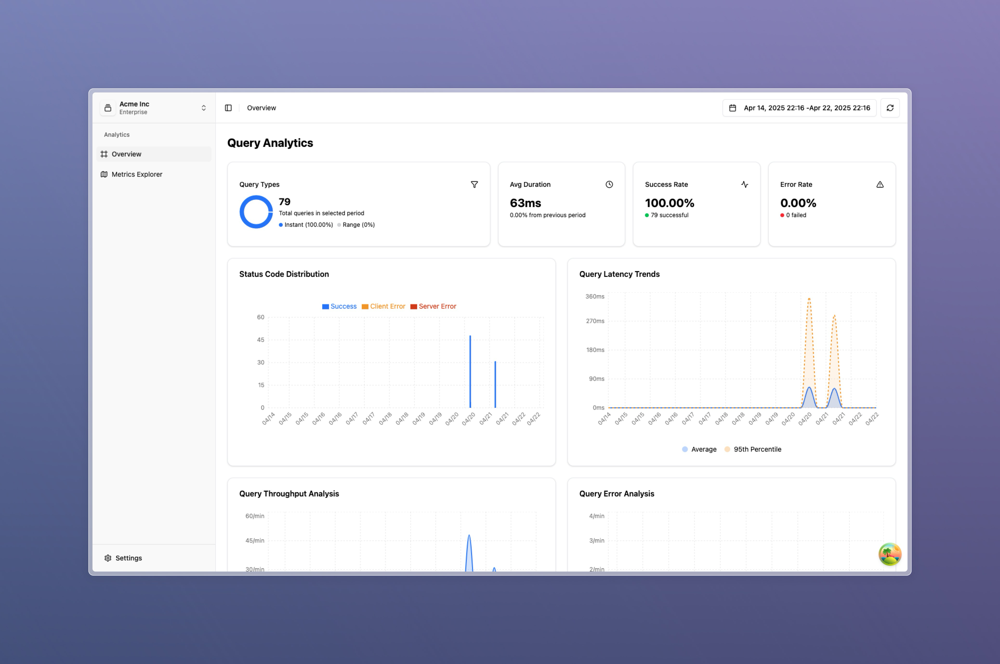

# prom-analytics-proxy

[](https://github.com/nicolastakashi/prom-analytics-proxy/actions/workflows/ci.yaml)

## Table of Contents

- [Overview](#overview)
- [Features](#features)
- [Project Structure](#project-structure)

## Overview

`prom-analytics-proxy` is a lightweight proxy application designed to sit between your Prometheus server and its clients. It provides valuable insights by collecting detailed analytics on PromQL queries, helping you understand query performance, resource usage, and overall system behavior. This can significantly improve observability for Prometheus users, providing actionable data to optimize query execution and infrastructure.




## Features

There are several key features that `prom-analytics-proxy` offers to enhance your Prometheus monitoring setup:

### Query Analytics

Collects detailed statistics on PromQL queries, including query execution times, resource consumption, and the number of series touched.

### Metrics Usage

Offers seamless integration with Perses Metrics Usage to gather and correlate metrics usage data from multiple sources—such as Recording Rules, Alerts, and Dashboards, alongside existing metrics and queries for deeper insights. For more information please check the [Metrics Usage Integration](#metrics-usage-integration) section.

### Data Storage

Supports storing the collected analytics data in either PostgreSQL or SQLite, giving flexibility based on your database preferences.

### User Interface

Offers an intuitive web-based UI for exploring and visualizing analytics data, enabling engineers to make data-driven decisions for query optimization. Includes Query Shortcuts for quick access to frequently used query patterns.

## Project Structure

The project is organized into the following core components:

- **`prom-analytics-proxy`**: A Go-based backend application responsible for acting as a proxy between Prometheus and clients. It captures and processes analytics from PromQL queries, offering insights into query performance metrics such as execution time, resource usage, and efficiency.

- **`prom-analytics-proxy-ui`**: A React-based user interface located in the `ui` directory. This component provides a visual platform to explore the analytics data collected by the proxy, making it easier to analyze and identify trends in PromQL queries.

Both components are designed to work together, with `prom-analytics-proxy` handling data collection and backend logic, while `prom-analytics-proxy-ui` provides a frontend interface for exploring query insights.

## Configuration

The `prom-analytics-proxy` application supports several configuration options that can be set via command-line flags or configuration file, using the `-config-file` flag.

```bash mdox-exec="go run main.go --help" mdox-expect-exit-code=0
  -config-file string
    	Path to the configuration file, it takes precedence over the command line flags.
  -database-provider string
    	The provider of database to use for storing query data. Supported values: postgresql, sqlite.
  -include-query-stats
    	Request query stats from the upstream prometheus API.
  -insecure-listen-address string
    	The address the prom-analytics-proxy proxy HTTP server should listen on. (default ":9091")
  -insert-batch-size int
    	Batch size for inserting queries into the database. (default 10)
  -insert-buffer-size int
    	Buffer size for the insert channel. (default 100)
  -insert-flush-interval duration
    	Flush interval for inserting queries into the database. (default 5s)
  -insert-grace-period duration
    	Grace period to insert pending queries after program shutdown. (default 5s)
  -insert-timeout duration
    	Timeout to insert a query into the database. (default 1s)
  -log-format string
    	Log format (text, json) (default "text")
  -log-level string
    	Log level (default "INFO")
  -metadata-limit uint
    	The maximum number of metric metadata entries to retrieve from the upstream prometheus API. (default 0 which means no limit)
  -postgresql-addr string
    	Address of the postgresql server. (default "localhost")
  -postgresql-database string
    	Database for the postgresql server, can also be set via POSTGRESQL_DATABASE env var.
  -postgresql-dial-timeout duration
    	Timeout to dial postgresql. (default 5s)
  -postgresql-password string
    	Password for the postgresql server, can also be set via POSTGRESQL_PASSWORD env var.
  -postgresql-port int
    	Port of the postgresql server. (default 5432)
  -postgresql-sslmode string
    	SSL mode for the postgresql server. (default "disable")
  -postgresql-user string
    	Username for the postgresql server, can also be set via POSTGRESQL_USER env var.
  -series-limit uint
    	The maximum number of series to retrieve from the upstream prometheus API. (default 0 which means no limit)
  -sqlite-database-path string
    	Path to the sqlite database. (default "prom-analytics-proxy.db")
  -upstream string
    	The URL of the upstream prometheus API.
```

### Tracing Support

The prom-analytics-proxy application includes built-in support for distributed tracing using OpenTelemetry. To enable tracing, you must provide a configuration file specifying the tracing settings. Below is an example configuration and details for each option:

```yaml
tracing:
  client_type: ""
  service_name: ""
  resource_attributes: {}
  reconnection_period: 0s
  compression: ""
  insecure: false
  endpoint: ""
  url_path: ""
  timeout: 0s
  retry_config:
    retry_enabled: false
    retry_initial_interval: 0s
    retry_max_interval: 0s
    retry_max_elapsed_time: 0s
  headers: {}
  tls_config:
    ca_file: ""
    cert_file: ""
    key_file: ""
    server_name: ""
    insecure_skip_verify: false
  sampler_type: ""
  sampler_param: ""
```

### Metrics Usage Integration

The `prom-analytics-proxy` application integrates with Perses Metrics Usage to gather and correlate metrics usage data from multiple sources. Essentially, `prom-analytics-proxy` acts as a backend for the Metrics Usage frontend, providing the data needed to populate the UI.

Because Metrics Usage is a separate project, you must deploy it alongside `prom-analytics-proxy` to enable this feature. Once configured, `prom-analytics-proxy` sends the collected data to the Metrics Usage backend, which is then displayed in the Metrics Usage UI. For more information, see the [Metrics Usage repository](https://github.com/perses/metrics-usage).

You can find a sample configuration file for the Metrics Usage integration in the `config` directory. The file includes the following options, assuming the `prom-analytics-proxy` is running on `localhost:9091`:

```yaml
metric_collector:
  enable: true
  http_client:
    url: "https://demo.promlabs.com"

rules_collectors:
  - enable: true
    prometheus_client:
      url: "https://demo.promlabs.com"
    metric_usage_client:
      url: "http://localhost:9091"

labels_collectors:
  - enable: true
    prometheus_client:
      url: "https://demo.promlabs.com"
    metric_usage_client:
      url: "http://localhost:9091"
perses_collector:
  enable: true
  perses_client:
    url: "https://demo.perses.dev"
  metric_usage_client:
    url: "http://localhost:9091"
```
