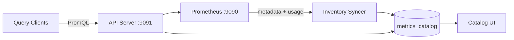
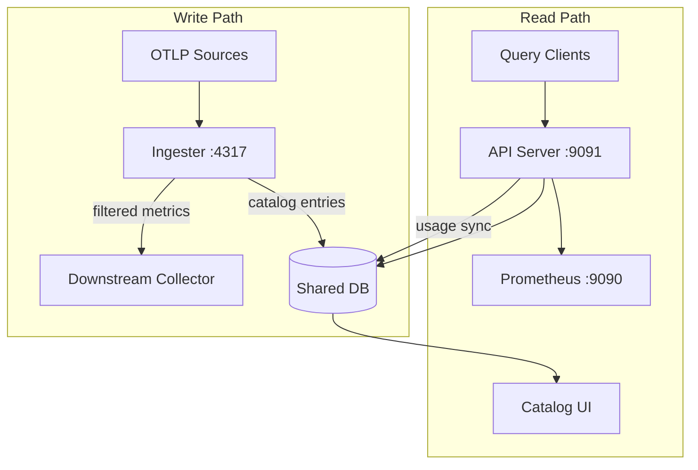

# OTLP Ingester & Deployment Modes

The OTLP ingester is an optional component that sits on the **write path** of your metrics pipeline. It receives OTLP metrics, filters unused ones based on the catalog, and forwards the remainder to a downstream backend (e.g. an OTel Collector or Prometheus remote-write receiver).

## Deployment Modes

The proxy supports two distinct deployment modes depending on whether the OTLP ingester is used.

### Analytics-Only Mode (default)

A single instance runs both the API server and the inventory syncer. Metrics are discovered by pulling metadata from Prometheus on a schedule. No ingester is required.



**Configuration:**

```yaml
# config.yaml
inventory:
  enabled: true
  metadata_sync_enabled: true  # default — fetch catalog from Prometheus
```

This is the right mode when you want query analytics and visibility into unused metrics, but do not need automatic write-path filtering.

### Ingester Mode

Two separate instances share the same database:

- **Ingester instance** — receives OTLP metrics, filters unused ones, populates the catalog from live traffic.
- **API server instance** — handles query analytics, the catalog UI, and usage aggregation (alerts, recording rules, dashboards, queries). Does **not** fetch Prometheus metadata since the ingester provides the catalog.



**API server config:**

```yaml
inventory:
  enabled: true
  metadata_sync_enabled: false  # ingester handles catalog population
```

**Ingester config:**

```yaml
ingester:
  catalog_sync:
    enabled: true
    flush_interval: 30s
    seen_ttl: 1h
  redis:
    enabled: true     # recommended: persists seen state across restarts
    addr: redis:6379
```

## Catalog Sync Configuration

When `catalog_sync.enabled` is true, the ingester buffers metric metadata seen in OTLP batches and periodically flushes it to the `metrics_catalog` table.

| Option | Default | Description |
|--------|---------|-------------|
| `enabled` | `false` | Enable catalog population from OTLP traffic |
| `flush_interval` | `30s` | How often to flush buffered metrics to the DB |
| `buffer_size` | `10000` | Maximum unique metrics to buffer per flush interval |
| `seen_ttl` | `1h` | Suppression window after a metric is flushed. After expiry the metric is re-written to refresh `last_synced_at` |

### Deduplication

The ingester avoids redundant DB upserts with a two-layer strategy:

1. **Pending map** — within a flush interval each metric name is queued at most once, regardless of how many OTLP batches contain it.
2. **Seen state** — after a successful flush, metrics are suppressed from re-queuing until `seen_ttl` expires.

The seen state is stored differently depending on whether Redis is configured:

| Redis | Seen state storage | Restart behaviour |
|-------|--------------------|-------------------|
| Disabled | In-memory map | Lost on restart; one re-flush burst at startup |
| Enabled | Redis (`catalog_seen:` key prefix) | Survives restarts; no re-flush burst |

When Redis is enabled, the same connection settings as the metric usage cache are reused (`ingester.redis.*`). No additional Redis configuration is needed.

## Inventory Syncer — `metadata_sync_enabled`

The `inventory.metadata_sync_enabled` flag controls whether the syncer fetches metric metadata from Prometheus and writes it to `metrics_catalog`:

- **`true` (default)** — full sync: fetch metadata from `/api/v1/metadata`, upsert catalog, refresh usage summary.
- **`false`** — usage-only sync: skip metadata fetch, only run `RefreshMetricsUsageSummary`. Use this on the API server when the ingester is handling catalog population.

Usage summary aggregation (alert counts, recording rule counts, dashboard counts, query counts) always runs regardless of this flag.

## Running the Ingester

```bash
./prom-analytics-proxy ingester \
  -database-provider postgresql \
  -postgresql-addr postgres.example.com \
  -otlp-listen-address :4317 \
  -otlp-downstream-address collector:4317 \
  -ingester-catalog-sync-enabled \
  -ingester-catalog-sync-flush-interval 30s \
  -ingester-catalog-sync-seen-ttl 1h \
  -ingester-cache-enabled \
  -ingester-cache-addr redis:6379
```

Or via config file:

```yaml
ingester:
  otlp:
    listen_address: ":4317"
    downstream_address: "collector:4317"
  catalog_sync:
    enabled: true
    flush_interval: 30s
    buffer_size: 10000
    seen_ttl: 1h
  redis:
    enabled: true
    addr: "redis:6379"
    used_ttl: 1h
    unused_ttl: 2m
```

## Observability

The ingester exposes the following Prometheus metrics for the catalog sync path:

| Metric | Type | Description |
|--------|------|-------------|
| `ingester_catalog_buffer_size` | Gauge | Current number of unique metrics in the pending buffer |
| `ingester_catalog_buffer_dropped_total` | Counter | Metrics dropped because the buffer was full |
| `ingester_catalog_flush_duration_seconds` | Histogram | Duration of each catalog DB flush |
| `ingester_catalog_flush_metrics_total` | Counter | Total metrics written to the catalog |
| `ingester_catalog_flush_errors_total` | Counter | Catalog flush errors |

These are available on the ingester's metrics endpoint (default `:9090/metrics`).
